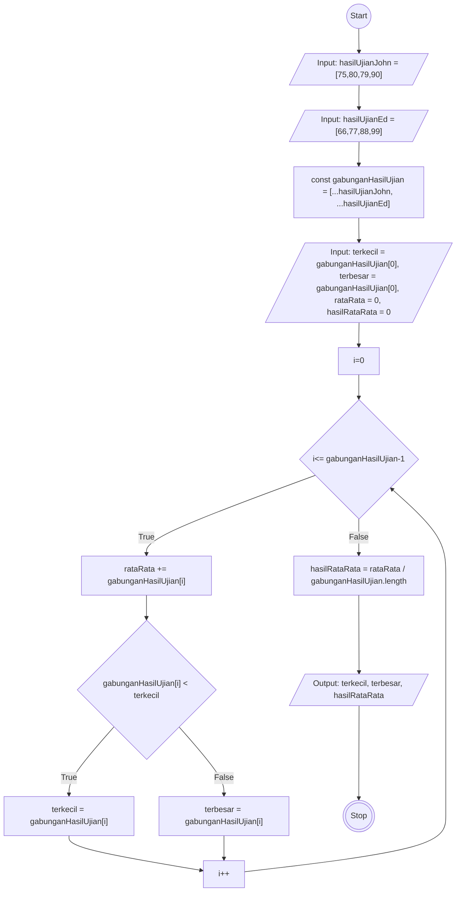

```mermaid
flowchart TD
idStart((Start))
idInputArr1[/"Input: hasilUjianJohn = [75,80,79,90]"/]
idInputArr2[/"Input: hasilUjianEd = [66,77,88,99]"/]
idProcessArr["const gabunganHasilUjian = [...hasilUjianJohn, 
    ...hasilUjianEd] "]
idInput[/"Input: terkecil = gabunganHasilUjian[0], terbesar = gabunganHasilUjian[0], rataRata = 0, hasilRataRata = 0"/]
idFor[i=0]
idLoop{i<= gabunganHasilUjian-1}
idRata["rataRata += gabunganHasilUjian[i]"]
idKondisi{"gabunganHasilUjian[i] < terkecil"}
idRataRata["hasilRataRata = rataRata / gabunganHasilUjian.length"]
idKondisiTrue["terkecil = gabunganHasilUjian[i]"]
idKondisiFalse["terbesar = gabunganHasilUjian[i]"]
idIPlus["i++"]
idHasil[/Output: terkecil, terbesar, hasilRataRata/]
idStop(((Stop)))

idStart --> idInputArr1 --> idInputArr2 --> idProcessArr --> idInput --> idFor --> idLoop

idLoop -- True --> idRata --> idKondisi
idLoop -- False --> idRataRata

idKondisi -- True --> idKondisiTrue --> idIPlus
idKondisi -- False --> idKondisiFalse --> idIPlus

idIPlus --> idLoop
idRataRata --> idHasil --> idStop


```